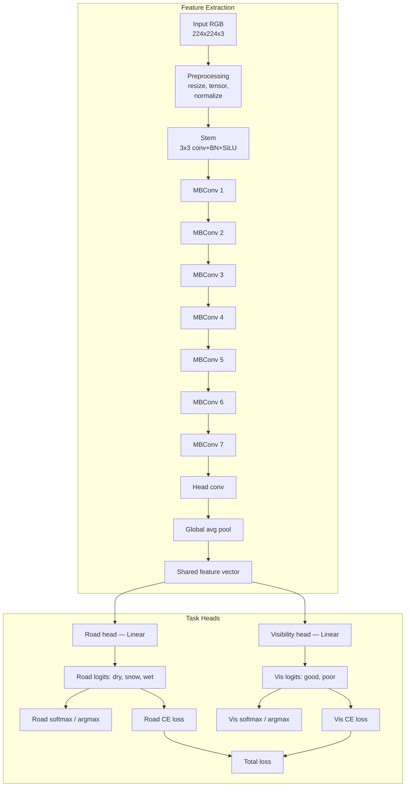
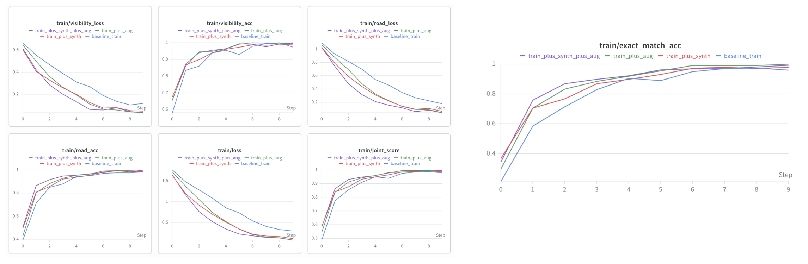
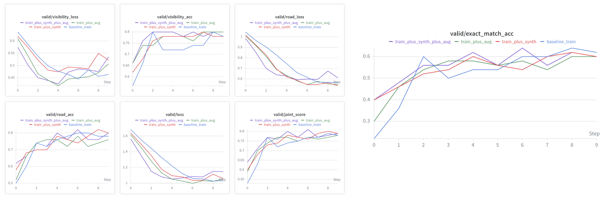
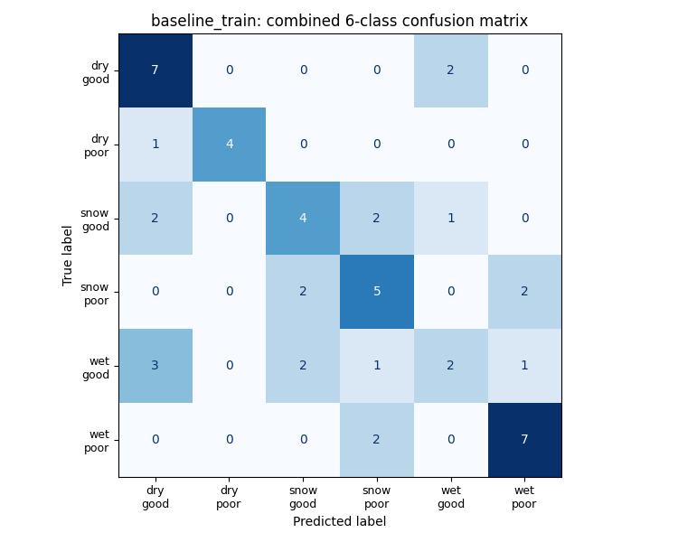
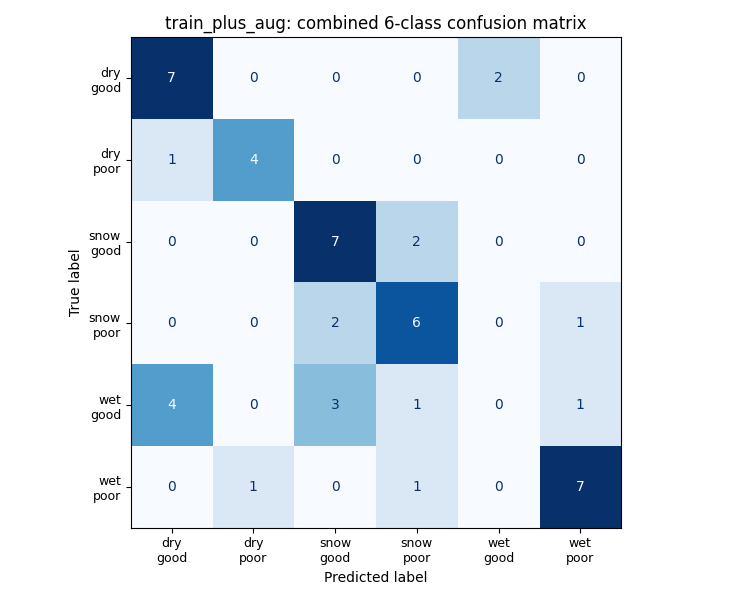
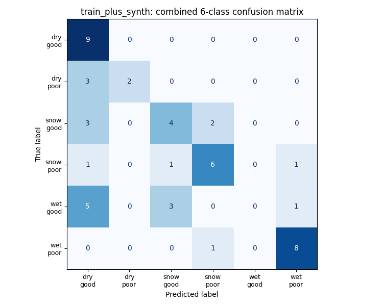
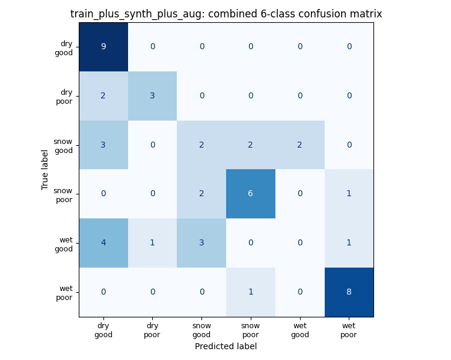
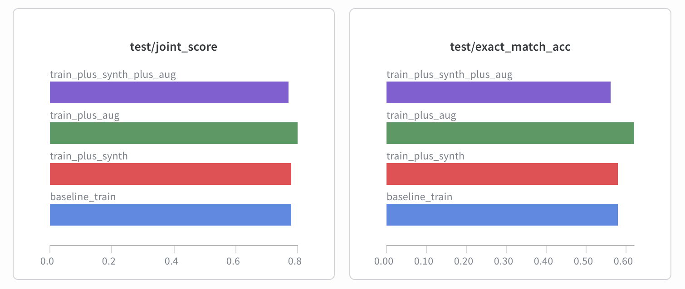
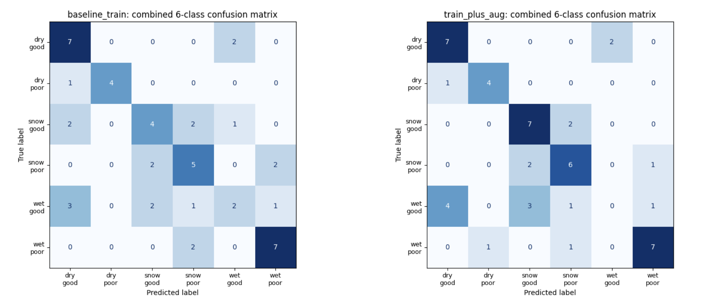
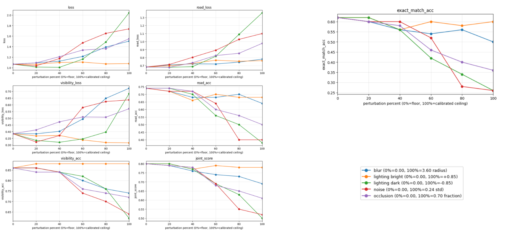

# Report and Tutorial 

## Sources
- ChatGPT used. Prompts:
    - write a gradio app where i can click any test image from a gallery, see the image on one side and the predicted road/visibility classes on the other
    - make the app load a hardcoded BEST_MODEL_PATH and show the checkpoint name, corpus name, and probabilities for both classifier heads
    - add dials below the image for synthesized noise, blur, lighting change, and occlusion
    - change the dials to use percentages instead of raw values, where 0 means none and 100 means the calibrated ceiling
    - make sure the app shows the test index, filename, and output_path so i can debug mislabeled samples
    - split lighting into one signed percentage control so negative is darkening and positive is brightening

- External Sources:
    - https://www.gradio.app/main/docs/gradio/blocks
    - https://www.gradio.app/docs/gradio/gallery
    - https://docs.pytorch.org/vision/stable/models/efficientnet
    - https://pillow.readthedocs.io/en/stable/reference/ImageEnhance.html
    - https://pillow.readthedocs.io/en/stable/reference/ImageFilter.html
    - https://github.com/enricivi/RWVC-BDD100K#main-references

## Model Selectioon

Backbone: EfficientNet-B0

Why?
- fast training and inference
- relatively small parameter count, so it is practical on limited
compute
- strong transfer-learning performance from ImageNet pretraining
- good accuracy-to-efficiency tradeoff compared with heavier backbones
- suitable for a small dataset, where a very large backbone would be
more likely to overfit
- easy to adapt into a shared-feature, multi-head classifier for
predicting both road condition and visibility

### Architecture

## Dataset

The dataset used is a tweaked version of BDD100K dashcam dataset: https://github.com/enricivi/RWVC-BDD100K#main-references

This dataset is relevant to real world applications like self drivinf cars that might have different driving profiles/settings based on the conditions of its surroundings.

There are 2 buckets: road condition with 3 classes and visibility condition with 2 classes. This means the dataset has 6 permutations of roads classified. Details for this are mentioned below.

Synthesis was done with the GPT-Image-1-mini model.
### Split Sizes
| Split | Images |
| --- | ---: |
| train | 200 |
| train+aug | 336 |
| train+synth | 336 |
| train+aug+synth | 456 |
| valid | 50 |
| test | 50 |

### Bucket Counts
| Split | Road | Visibility | Images | Bucket |
| --- | --- | --- | ---: | --- |
| train | dry | good | 35 | dry / good |
| train | dry | poor | 21 | dry / poor |
| train | snow | good | 36 | snow / good |
| train | snow | poor | 36 | snow / poor |
| train | wet | good | 36 | wet / good |
| train | wet | poor | 36 | wet / poor |
| train+aug | dry | good | 56 | dry / good |
| train+aug | dry | poor | 56 | dry / poor |
| train+aug | snow | good | 56 | snow / good |
| train+aug | snow | poor | 56 | snow / poor |
| train+aug | wet | good | 56 | wet / good |
| train+aug | wet | poor | 56 | wet / poor |
| train+synth | dry | good | 56 | dry / good |
| train+synth | dry | poor | 56 | dry / poor |
| train+synth | snow | good | 56 | snow / good |
| train+synth | snow | poor | 56 | snow / poor |
| train+synth | wet | good | 56 | wet / good |
| train+synth | wet | poor | 56 | wet / poor |
| train+aug+synth | dry | good | 76 | dry / good |
| train+aug+synth | dry | poor | 76 | dry / poor |
| train+aug+synth | snow | good | 76 | snow / good |
| train+aug+synth | snow | poor | 76 | snow / poor |
| train+aug+synth | wet | good | 76 | wet / good |
| train+aug+synth | wet | poor | 76 | wet / poor |
| valid | dry | good | 9 | dry / good |
| valid | dry | poor | 5 | dry / poor |
| valid | snow | good | 9 | snow / good |
| valid | snow | poor | 9 | snow / poor |
| valid | wet | good | 9 | wet / good |
| valid | wet | poor | 9 | wet / poor |
| test | dry | good | 9 | dry / good |
| test | dry | poor | 5 | dry / poor |
| test | snow | good | 9 | snow / good |
| test | snow | poor | 9 | snow / poor |
| test | wet | good | 9 | wet / good |
| test | wet | poor | 9 | wet / poor |

## Evaluation and Analysis

### Metrics
- Visibility Cross Entropy Loss (Vis CE)
- Road Condition CE (Road CE)
- Total Loss = Vis CE + Road CE

- Visibility Accuracy
- Road Condition Accuracy
- Joint Accuracy (0.5 for 1 correct label)
- Exact Accuracy (0 for 1 wrong label)

### Final Values
| Corpus | Train Splits | Loss | Road Loss | Visibility Loss | Road Acc | Visibility Acc | Joint Score | Exact Match Acc |
| --- | --- | ---: | ---: | ---: | ---: | ---: | ---: | ---: |
| baseline_train | train | 1.087889 | 0.730659 | 0.357230 | 0.70 | 0.86 | 0.78 | 0.58 |
| train_plus_synth | train+train_synth | 1.019910 | 0.647868 | 0.372042 | 0.72 | 0.84 | 0.78 | 0.58 |
| train_plus_aug | train+train_aug | 1.066748 | 0.682422 | 0.384326 | 0.74 | 0.86 | 0.80 | 0.62 |
| train_plus_synth_plus_aug | train+train_synth+train_aug | 1.050961 | 0.661925 | 0.389036 | 0.70 | 0.84 | 0.77 | 0.56 |

### Training Curves

### Validation Curves

### Confusion Matrices

   

### Best Model Chosen was Config 2

The metric chosen to take this decision were the accuracy scores.

### Comparison of Confusion Matrices

**Key Differences:**
Augmentation resulted in Snowy roads with good visibility being predicted 75% better. However, wet roads with good visibility sees a dip in correct predictions, in real world scenarios this is a net positive because snowy roads have the potential of being more dangerous than wet roads.

### Error analysis
The fundamental reason why wet/good has the least amount of hits is because the model sees a dip in classifying wet roads in particular. 

The reason for this is the dataset. Wet roads in the test roads are barely wet: droplets on the bonnet, small wet patches, etc. Meanwhile the training data has a lot of conventionally shiny-wet roads, which might have confused the model. Here are some examples of the test images:

## Robustness Analysis

### Perturbations
Robustness was evaluated by applying controlled synthetic perturbations to the test images before inference. Each perturbation was parameterized from `0%` to `100%`, where `0%` denotes no perturbation and `100%` denotes the calibrated maximum stress-test level used in the experiments.

Gaussian noise was introduced by adding zero-mean Gaussian noise independently to each RGB pixel after converting image intensities to the `[0,1]` range. The perturbation strength was controlled by the noise standard deviation `σ`, with:

`σ ∈ [0.00, 0.24]`

Gaussian blur was introduced using PIL’s `GaussianBlur` operator. Blur severity was controlled by the blur radius in pixels, with:

`radius ∈ [0.0, 3.6] pixels`

Darkening was introduced to simulate underexposure or darker illumination by reducing image brightness and contrast. This was controlled by a signed parameter `lighting_delta`, where negative values darken the image. At each level, the brightness factor was computed as `brightness_factor = 1 + lighting_delta`, and the contrast factor was computed as `contrast_factor = 1 + 0.5 * lighting_delta`. For darkening, the range used was:

`lighting_delta ∈ [0.00, -0.85]`

Brightening was introduced to simulate overexposure or stronger illumination by increasing image brightness and contrast using the same formulation, but with positive `lighting_delta` values. The range used was:

`lighting_delta ∈ [0.00, +0.85]`

Central occlusion was introduced by overlaying a centered black rectangular patch on the image. The perturbation was parameterized by `occlusion_fraction`, defined as the approximate fraction of total image area covered by the patch. The range used was:

`occlusion_fraction ∈ [0.00, 0.70]`

For all perturbations, robustness was measured by evaluating the selected model on the unchanged test split at multiple perturbation levels between `0%` and `100%`.

### Visualizations

Within the parameter ranges set, there is a clear trend in what the model is the most and least resistant to. It is generally resistant to brightening the lighting and blur. It is catastraphocally weak to darkening the image and increasing noise, which is understandable, because in both cases it might push the pixel values OOD. This demo can be reacreated as well.

## Steps for recreation

### Analysis scripts
1. Uplaod datasets to colab.
2. Upload ipynb to colab. Run all after configuring dataset path in the cell connecting google drive.

### Robustness Visualizer
1. Make sure the `DataOps` and `TrainTestEval.ipynb` notebooks have been run to save the models, or save the models from the repository.
2. Upload `robustness_eval.ipynb` on google colab, along with `robustness_utils.py` and `best_model_gradio.py` as files to the notebook.
3. Open terminal on colab, and type `python best_model_gradio.py`, and open the link the terminal shows you. That is the app.
